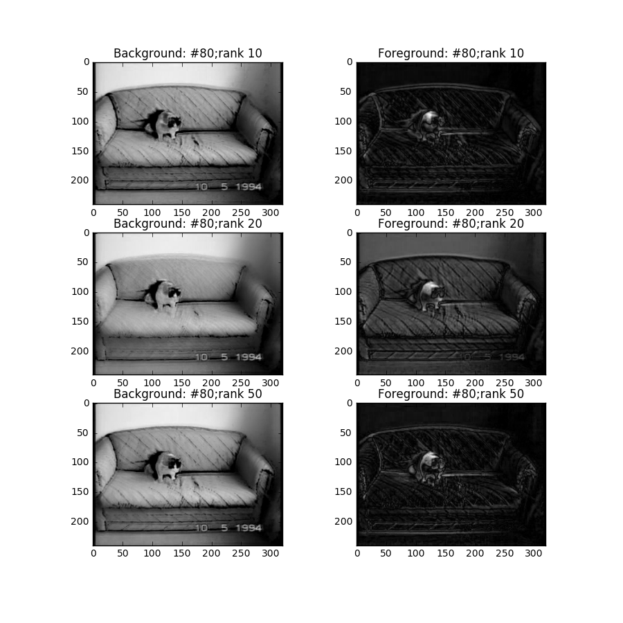

DATA2017: Dynamical Mode Decomposition: Application on Robust Video Background/Foreground separation
===
# Abstract
Dynamical mode decomposition (DMD) is a novel technique used to analyze non-linear dynamical system represented in time series data. DMD inherits dimension reduction backbone of SVD but proceeds further in extracting the temporal features of a system. We evaluated the performance of DMD in the context of generating background/foreground separation in videos. We examined the performance of the algorithm by integrating various parameters.

# A: Introduction && Overview
DMD is a novel dimensionality reduction algorithm developed by Peter Schmid in 2008. It can be applied on nonlinear dynamical systems as an equation-free manner to extract temporal features by decomposing the state of the system into low-rank terms whose Fourier components in time are known.

Grosek & Kutz (2014) adopted DMD as a novel approach to robustly separating video frames into background and foreground components in real time. The idea is that DMD terms with Fourier frequencies near the origin (zero-modes) are interpreted as background (low-rank) portions of the given video frames, and the terms with Fourier frequencies bounded away from the origin are their sparse counterparts.

# B:Theoretical Background
## Overview    
Time sieres data can be thought of as snapshots in time. Mathmatically,  
$$X = [x1,x2,x3,...,x_i]$$  
where $x_i$ are vectors containing states of the system at a particular disctre time point. We make an assumption that says snapshots are linearly corrletated in time: $x_{i} = A x_{i-1}$. In other words, snapshot $x_{i+1}$ can be expressed as a linear combition of all previsous states $x_1, x_2, ..., x_n$ and a bias or residual $r$ that is orthognoal to the space spanned by $x_1, x_2, ..., x_n$.

## B1: DMD Algorithm  
The SVD-based approach is as follows:
In summary, the SVD-based approach is as follows:

> 1. Split the time series of data in $X^{N}$ into the two matrices $X_{1}^{N-1}$ and $X_{2}^{N}$   
> 2. Compute the SVD of $X_{1}^{N-1}=U \Sigma V^{*}$
> 3. Form the matrix $\tilde {S}=U^{*}X_{2}^{N}V \Sigma ^{-1}$ and compute its eigenvalues $\lambda_{i}$  and eigenvectors $y_{i}$

## B2: DMD Video Application
The fact makes separation of background and foreground possible for using DMD rely on a key idea that any portion of the first video frame that does not change over time, or changes very slowly in time, must have an associated Fourier mode $\omega_j$ that is located near the origin in complex space: $\parallel \omega \parallel\ \approx 0$. This fact becomes the key principle that makes possible the ability of the DMD method to separate background (approximate low-rank) information from foreground (approximate sparse) information.

# C: Algorithm Development
A sample video `cat.mp4` is selected as a working demo for algorithm development. This 4 seconds video includes a cat emerging from inside a sofa. Note that there is video was recorded in shaky condition and thus minor noises were introduced.

## C1: Block Diagram
Figure 1 shows a block diagram of the pipeline of the algorithm. Here is a  a list of functions and explanations with Matlab codes.

img[alt=DMD_block] { width: 200px; }

*figure 1. block diagram of the DMD algorithm for video background/foreground sepration.*  

__SVD():__ A standard dimension reduction operation on $X_1$ to examine if there are some "basic chemistry" that makes up the sample space.  

	[U,Sigma,V]() = svd(X1,'econ')

__f_stilda():__ Function that calculates `S_tilda` Note that `/` in __matlab__ tries to give a linear regression on a overdetermined matrix by optimizing the $L_2$ norm.

    Stilda = U'*X2*V/Sigma

__ED():__ Eigenvalue decomposition on `Stilda`. Note that `W` contains the eigen vectors; `D` are eigenvalues.

    [W,D]() = eig(Stilda)

__f_fourier():__ Fourier transformation that project eigenvectors and eigenvalues of the DMD modes to Fourier space.

    Phi = U*W;   
    Lambda = diag(D);  
    Omega = log(Lambda)/dt;

__f_sperate():__  operation that separates the background and foreground. Variables with `X_dmd_lr` is calculated by incorprating a filtered `Omega`, `Omega_lr`. `Omega_lr` contains only special eigenvalues whose absoulte values are nearly zero. See details in `exp4_matlab.m`.

## C2: DATA Visualization
The following lists of plots are used to understand the intrinsic features of the temporal data encompassed in the `cat.mp4`.

>1. Singular Values of `X1`
>2. Spectral eigenvalues corresponding to the DMD modes
>3. Reconstructed background/foreground with 2,10,50 modes
>4. Average pixel intensity error

# D Computational Results
We present the results as the following:
>1. SVD Results
>2. DMD Results

##D1. SVD Results
SVD is applied on `X1`. Figure 2 shows the result. One dominant mode is obtained, which suggests in the future space `U`, there exists a single dominant vector that by itself describes the system with 60% "completeness". This matches our expectation in that the dominant mode corresponds to the movement of the cat. The other modes are probably describing the subtle movement of the sofa trigged by the cat and the noise induced by a shaky recorder.

*figure 2: singular values of X1 normalized by sum *

##D2: DMD Results
DMD gives promising separation result in analyzing `cat.mp4` as shown in figure 2. Firstly, we make an empirical judgment that using 10 DMD modes produces the best performance. The reason is that the upper right image of `Foreground #80; rank10` has pixels "outside" the cat being mostly black. Secondly, we try to justify this hypothesis by making quantitive comparisons using eigenvalues of `S_tilda` and evolution of error with respect to recovered data with rank 2.

*figure 2: Reconstructed background/foreground at 80th frame with DMD modes of rank: 10,20,50*

The spectral eigenvalues of the DMD modes are shown in the figure 3. Recall that DMD modes are the eigenvalues of `S_tilda` that have been mapped to the feature space `U` of `X1`. Note that `S_tilda` approximate the nonlinear transaction from `X1` to `X2`. Therefore, the DMD eigenvalues give indirect quantification of the stability of the system in predicting the future states.

*Figure 3: Spectral eigenvalues corresponding to the DMD modes*

Without a "true" foreground/background separation for error calculation, we attempt to understand the system better by benchmarking the difference of average pixel intensity with that of rank 2's. The evolution of error is shown in figure 4. A positive correlation between the number of modes kept and magnitudes of errors can be identified. This is what we expected: the more eigenvalues of `S_tilda` used to calculate the DMD modes, the better-reconstructed data it is. However, one interesting observation to make is on the sharp gradient in the error curve of rank10. Note that in `cat.mp4`, the cat starts to emerge from the sofa at approximately frame #40. Before that, it is hiding inside the sofa. The interpretation is that this is due to the fact that the eigenvalues of `rank10` are on average less "complex" compared to thank of `rank20` and `rank50`. In other words, keeping 10 spectral `S_tilda` modes best captures the cat and cat only, leaving out the noisy and unrealated sofa movement.

  
*Figure 4: Average reconstructed foreground pixel intensity error with respect to rank 2's*

# E: Summary and Conclusions
Non-linear dynamical systems CAN be analyzed and even predicted using a novel technique: Dynamical Mode Decomposition. The idea is that temporal features of a non-linear dynamical system are imbedded as eigenvalues and eigenvectors `W,D` in the approximate form of Koopman operator, `S_tilda`.  

We exmained three parameters that can be used to analyze the performance of a DMD model on all systems:
>1. sigular values of the first snap shot `X1`; 2) >2.
>2. eigenvalues `D` in the complex plane
>3. evolution of error of model output with respect to ground truth (validation or testing set).    

Finally, some future works that can be done:
>1. examine the effect of thresholding aggressiveness to the model performance
>2. optimize numbers of DMD modes to keep and the model performance
